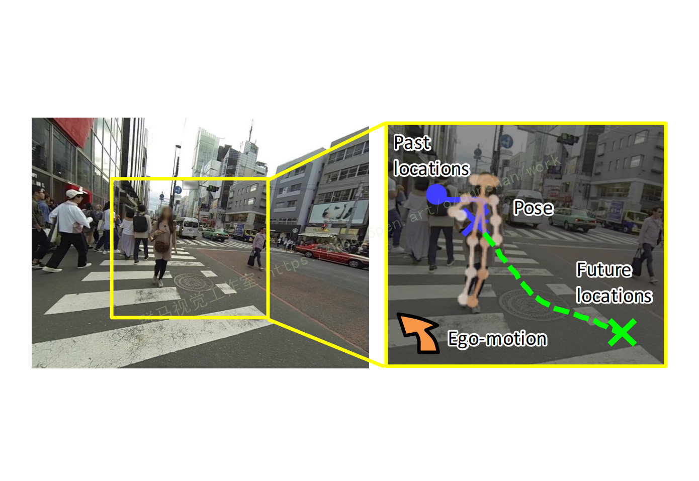
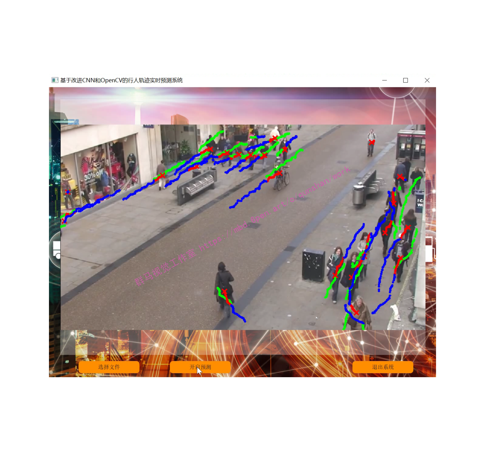
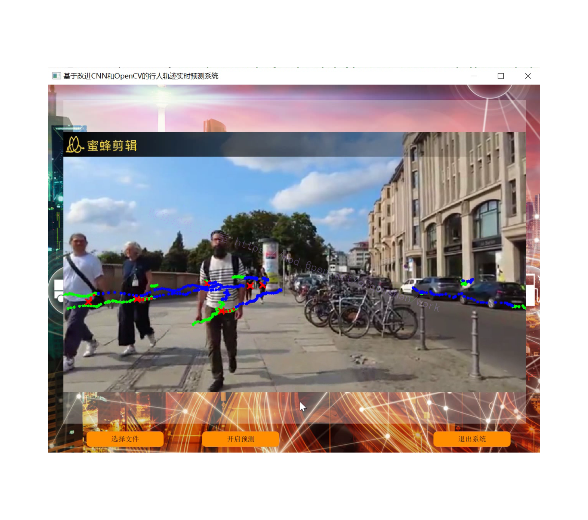
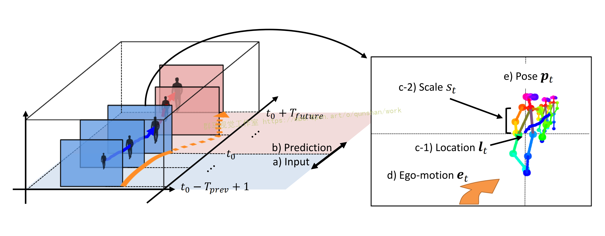
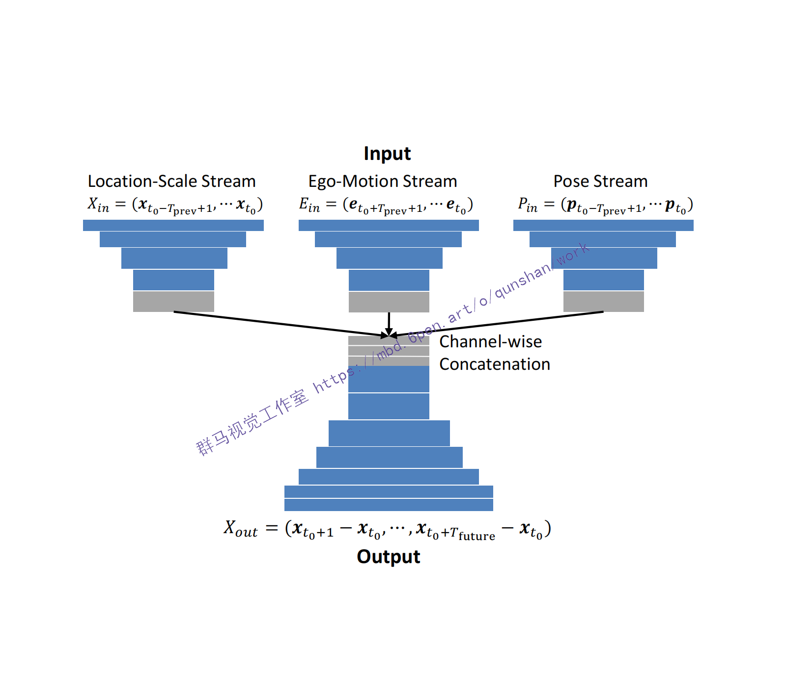
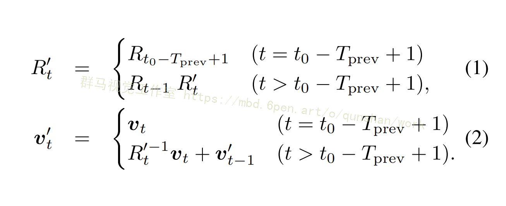
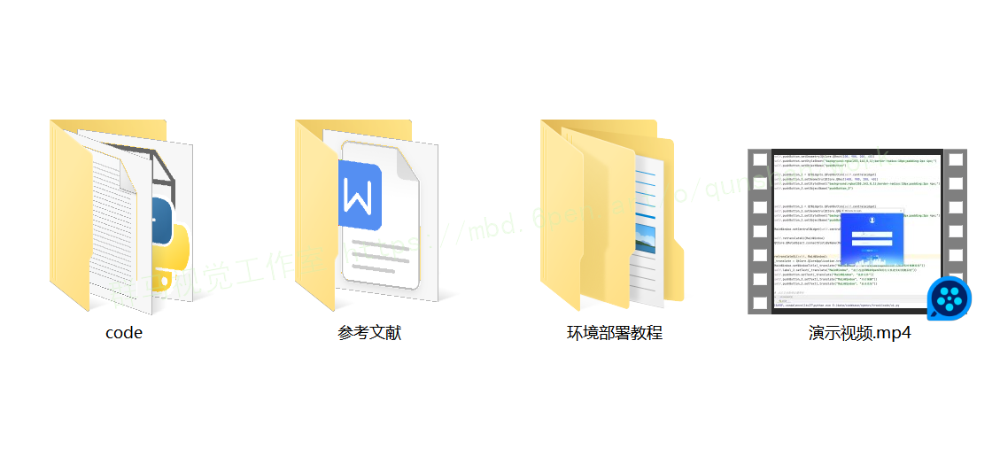

# 1.研究背景
辅助技术作为第一人称视觉的一种有前途的应用，正受到越来越多的关注，如谷歌眼镜和GoPro HERO。就像我们使用眼睛的方式一样，第一人称视觉技术可以作为一个人工视觉系统，感知相机佩戴者周围的世界，并让他们决定下一步该做什么。最近的工作集中在各种辅助技术上，如盲导航[20,39]，物体回声定位[38]，和人已实现的对象识别[15]。
在这项工作中，我们特别感兴趣的是帮助用户在拥挤的、在用户附近有许多人的地方导航。考虑一下用户用可穿戴相机记录的第一人称视频流。通过在特定的帧中为用户提供辅助服务，并预测他们随后如何移动，我们将能够指导用户避免碰撞。作为在拥挤的地方实现这种安全导航技术的第一步，这项工作提出了一个新的任务，预测人在未来帧中的位置，即预测的人定位，在第一人称视频中，如图所示。


# 2.图片演示




# 3.视频演示
[基于改进CNN和OpenCV的行人轨迹实时预测系统（源码＆教程）_哔哩哔哩_bilibili](https://www.bilibili.com/video/BV1B84y1t78U/?vd_source=bc9aec86d164b67a7004b996143742dc)

# 4.改进的算法结构框图




# 5.Ego-Motion模块
虽然Xin明确地描述了目标人如何可能随着时间的推移而移动，但由于Xin的自我运动，直接预测Xout仍然具有挑战性。更具体地说，描述每个点l的协同系统会随着相机佩戴者的移动而动态变化。这使得Xin和Xout都取决于目标人的行走轨迹和相机佩戴者的自我运动。
此外，相机佩戴者的自我运动可能会影响目标人之间的互动而影响他们的移动方式。例如，考虑一个目标人向相机佩戴者走的情况。当目标人和相机佩戴者注意到它们很快就会发生碰撞时，它们就会明确或含蓄地发生碰撞调整自己，以改变他们行走的速度和调整，以避免潜在的碰撞。[虽然该博客的一些工作](https://mbd.pub/o/bread/Y52Wlplr)试图将这种互动行为纳入人类轨迹预测，但他们的方法需要所有互动的人在静态摄像机视图中观察，不能直接应用于我们的案例。
为了提高未来第一人称视频的定位性能，我们建议学习相机佩戴者是如何移动的，即自我运动提示。具体地说，我们首先估计连续帧之间的旋转和平移。旋转由旋转matrix R∈R3×3描述，平移由一个三维向量o∈R3（即，x，y，z轴）描述，在帧坐标系的帧1到t坐标系。这些向量表示成功帧之间的局部运动，但是，并不能捕获沿着多个帧的全局运动。因此，对于输入区间内的每个帧，我们累积这些向量来描述在帧时的摄像机坐标系中的时变自我运动模式。


# 6.Pose模块
[参考该博客提出的方案，使用第一人称视频的另一个显著优势是能够近距离观察人们。](https://afdian.net/item?plan_id=de1f0d1879f111ed8d5f52540025c377)这使得他们更容易捕捉到他们所摆出的姿势（例如，他们所定位的方向），这可以作为他们将要走的方向的另一个强有力的指示器。
图3中的“姿态”流旨在对目标人的这些姿态信息进行编码。更具体地说，我们追踪焦油的几个身体部位的时间变化
[外链图片转存失败,源站可能有防盗链机制,建议将图片保存下来直接上传(img-2uuxj55j-1670835256102)(https://upload-images.jianshu.io/upload_images/28411888-69de5dfff659f205.png?imageMogr2/auto-orient/strip%7CimageView2/2/w/1240)]

# 7.代码实现
```
#! /usr/bin/env python
# -*- coding: utf-8 -*-
# vim:fenc=utf-8
#
# Copyright © 2017 Takuma Yagi <tyagi@iis.u-tokyo.ac.jp>
#
# Distributed under terms of the MIT license.

import numpy as np

import chainer
import chainer.functions as F
import cupy
from chainer import Variable, cuda

from logging import getLogger
logger = getLogger("main")

from models.module import Conv_Module, Encoder, Decoder


class CNNBase(chainer.Chain):
    def __init__(self, mean, std, gpu):
        super(CNNBase, self).__init__()
        self._mean = mean
        self._std = std
        self.nb_inputs = len(mean)
        self.target_idx = -1

        # Send mean and sd of the dataset to GPU to produce prdiction result in the image coordinate
        self.mean = Variable(cuda.to_gpu(mean.astype(np.float32), gpu))
        self.std = Variable(cuda.to_gpu(std.astype(np.float32), gpu))

    def _prepare_input(self, inputs):
        pos_x, pos_y, poses, egomotions = inputs[:4]
        if pos_y.data.ndim == 2:
            pos_x = F.expand_dims(pos_x, 0)
            pos_y = F.expand_dims(pos_y, 0)
            if egomotions is not None:
                egomotions = F.expand_dims(egomotions, 0)
            poses = F.expand_dims(poses, 0)

        # Locations
        # Note: prediction target is displacement from last input
        x = (pos_x - F.broadcast_to(self.mean, pos_x.shape)) / F.broadcast_to(self.std, pos_x.shape)
        y = (pos_y - F.broadcast_to(self.mean, pos_y.shape)) / F.broadcast_to(self.std, pos_y.shape)
        y = y - F.broadcast_to(x[:, -1:, :], pos_y.shape)

        # Egomotions
        past_len = pos_x.shape[1]
        if egomotions is not None:
            ego_x = egomotions[:, :past_len, :]
            ego_y = egomotions[:, past_len:, :]

        # Poses
        poses = F.reshape(poses, (poses.shape[0], poses.shape[1], -1))
        pose_x = poses[:, :past_len, :]
        pose_y = poses[:, past_len:, :]

        if egomotions is not None:
            return x, y, x[:, -1, :], ego_x, ego_y, pose_x, pose_y
        else:
            return x, y, x[:, -1, :], None, None, pose_x, pose_y

    def predict(self, inputs):
        return self.__call__(inputs)


class CNN(CNNBase):
    """
    Baseline: location only
    """
    def __init__(self, mean, std, gpu, channel_list, dc_channel_list, ksize_list,
                 dc_ksize_list, inter_list, last_list, pad_list):
        super(CNN, self).__init__(mean, std, gpu)
        if len(ksize_list) > 0 and len(dc_ksize_list) == 0:
            dc_ksize_list = ksize_list
        with self.init_scope():
            self.pos_encoder = Encoder(self.nb_inputs, channel_list, ksize_list, pad_list)
            self.pos_decoder = Decoder(dc_channel_list[-1], dc_channel_list, dc_ksize_list[::-1])
            self.inter = Conv_Module(channel_list[-1], dc_channel_list[0], inter_list)
            self.last = Conv_Module(dc_channel_list[-1], self.nb_inputs, last_list, True)

    def __call__(self, inputs):
        pos_x, pos_y, offset_x, ego_x, ego_y, pose_x, pose_y = self._prepare_input(inputs)
        batch_size, past_len, _ = pos_x.shape

        h = self.pos_encoder(pos_x)
        h = self.inter(h)
        h = self.pos_decoder(h)
        pred_y = self.last(h)
        pred_y = F.swapaxes(pred_y, 1, 2)
        pred_y = pred_y[:, :pos_y.shape[1], :]
        loss = F.mean_squared_error(pred_y, pos_y)

        pred_y = pred_y + F.broadcast_to(F.expand_dims(offset_x, 1), pred_y.shape)
        pred_y = cuda.to_cpu(pred_y.data) * self._std + self._mean
        return loss, pred_y, None


class CNN_Ego(CNNBase):
    """
    Baseline: feeds locations and egomotions
    """
    def __init__(self, mean, std, gpu, channel_list, dc_channel_list, ksize_list,
                 dc_ksize_list, inter_list, last_list, pad_list, ego_type):
        super(CNN_Ego, self).__init__(mean, std, gpu)
        ego_dim = 6 if ego_type == "sfm" else 96 if ego_type == "grid" else 24
        if len(ksize_list) > 0 and len(dc_ksize_list) == 0:
            dc_ksize_list = ksize_list
        with self.init_scope():
            self.pos_encoder = Encoder(self.nb_inputs, channel_list, ksize_list, pad_list)
            self.ego_encoder = Encoder(ego_dim, channel_list, ksize_list, pad_list)
            self.pos_decoder = Decoder(dc_channel_list[-1], dc_channel_list, dc_ksize_list[::-1])
            self.inter = Conv_Module(channel_list[-1]*2, dc_channel_list[0], inter_list)
            self.last = Conv_Module(dc_channel_list[-1], self.nb_inputs, last_list, True)

    def __call__(self, inputs):
        pos_x, pos_y, offset_x, ego_x, ego_y, pose_x, pose_y = self._prepare_input(inputs)
        batch_size, past_len, _ = pos_x.shape

        h_pos = self.pos_encoder(pos_x)
        h_ego = self.ego_encoder(ego_x)
        h = F.concat((h_pos, h_ego), axis=1)  # (B, C, 2)
        h = self.inter(h)
        h_pos = self.pos_decoder(h)
        pred_y = self.last(h_pos)  # (B, 10, C+6+28)
        pred_y = F.swapaxes(pred_y, 1, 2)
        pred_y = pred_y[:, :pos_y.shape[1], :]
        loss = F.mean_squared_error(pred_y, pos_y)

        pred_y = pred_y + F.broadcast_to(F.expand_dims(offset_x, 1), pred_y.shape)
        pred_y = cuda.to_cpu(pred_y.data) * self._std + self._mean
        return loss, pred_y, None


class CNN_Pose(CNNBase):
    """
    Baseline: feeds locations and poses
    """
    def __init__(self, mean, std, gpu, channel_list, dc_channel_list, ksize_list,
                 dc_ksize_list, inter_list, last_list, pad_list):
        super(CNN_Pose, self).__init__(mean, std, gpu)
        if len(ksize_list) > 0 and len(dc_ksize_list) == 0:
            dc_ksize_list = ksize_list
        with self.init_scope():
            self.pos_encoder = Encoder(self.nb_inputs, channel_list, ksize_list, pad_list)
            self.pose_encoder = Encoder(36, channel_list, ksize_list, pad_list)
            self.pos_decoder = Decoder(dc_channel_list[-1], dc_channel_list, dc_ksize_list[::-1])
            self.inter = Conv_Module(channel_list[-1]*2, dc_channel_list[0], inter_list)
            self.last = Conv_Module(dc_channel_list[-1], self.nb_inputs, last_list, True)

    def __call__(self, inputs):
        pos_x, pos_y, offset_x, ego_x, ego_y, pose_x, pose_y = self._prepare_input(inputs)
        batch_size, past_len, _ = pos_x.shape

        h_pos = self.pos_encoder(pos_x)
        h_pose = self.pose_encoder(pose_x)
        h = F.concat((h_pos, h_pose), axis=1)  # (B, C, 2)
        h = self.inter(h)
        h_pos = self.pos_decoder(h)
        pred_y = self.last(h_pos)  # (B, 10, C+6+28)
        pred_y = F.swapaxes(pred_y, 1, 2)
        pred_y = pred_y[:, :pos_y.shape[1], :]
        loss = F.mean_squared_error(pred_y, pos_y)

        pred_y = pred_y + F.broadcast_to(F.expand_dims(offset_x, 1), pred_y.shape)
        pred_y = cuda.to_cpu(pred_y.data) * self._std + self._mean
        return loss, pred_y, None


class CNN_Ego_Pose(CNNBase):
    """
    Our full model: feeds locations, egomotions and poses as input
    """
    def __init__(self, mean, std, gpu, channel_list, dc_channel_list, ksize_list,
                 dc_ksize_list, inter_list, last_list, pad_list, ego_type):
        super(CNN_Ego_Pose, self).__init__(mean, std, gpu)
        ego_dim = 6 if ego_type == "sfm" else 96 if ego_type == "grid" else 24
        if len(ksize_list) > 0 and len(dc_ksize_list) == 0:
            dc_ksize_list = ksize_list
        with self.init_scope():
            self.pos_encoder = Encoder(self.nb_inputs, channel_list, ksize_list, pad_list)
            self.ego_encoder = Encoder(ego_dim, channel_list, ksize_list, pad_list)
            self.pose_encoder = Encoder(36, channel_list, ksize_list, pad_list)
            self.pos_decoder = Decoder(dc_channel_list[-1], dc_channel_list, dc_ksize_list[::-1])
            self.inter = Conv_Module(channel_list[-1]*3, dc_channel_list[0], inter_list)
            self.last = Conv_Module(dc_channel_list[-1], self.nb_inputs, last_list, True)

    def __call__(self, inputs):
        pos_x, pos_y, offset_x, ego_x, ego_y, pose_x, pose_y = self._prepare_input(inputs)
        batch_size, past_len, _ = pos_x.shape

        h_pos = self.pos_encoder(pos_x)
        h_pose = self.pose_encoder(pose_x)
        h_ego = self.ego_encoder(ego_x)
        h = F.concat((h_pos, h_pose, h_ego), axis=1)  # (B, C, 2)
        h = self.inter(h)
        h_pos = self.pos_decoder(h)
        pred_y = self.last(h_pos)  # (B, 10, C+6+28)
        pred_y = F.swapaxes(pred_y, 1, 2)
        pred_y = pred_y[:, :pos_y.shape[1], :]
        loss = F.mean_squared_error(pred_y, pos_y)

        pred_y = pred_y + F.broadcast_to(F.expand_dims(offset_x, 1), pred_y.shape)
        pred_y = cuda.to_cpu(pred_y.data) * self._std + self._mean
        return loss, pred_y, None
```

# 8.系统整合
下图[完整源码＆环境部署视频教程＆自定义UI界面](https://s.xiaocichang.com/s/2d81b0)


参考博客[《基于改进CNN和OpenCV的行人轨迹实时预测系统（源码＆教程）》](https://mbd.pub/o/qunma/work)

# 9.参考文献
***
[1] A. Alahi,K. Goel,V.Ramanathan,A.Robicquet,L.FeiFei,and S. Savarese. Social lstm: Human trajectory prediction in crowded spaces. In Proceedings of the IEEE Conference on Computer Vision and Pattern Recognition, pages 961-971, 2016.2,4,5,6,7,8,9
[2] S.Alletto,G.Serra,S.Calderara,and R.Cucchiara.Understanding social relationships in egocentric vision. Pattern Recognition,48(12):4082-4096,2015.2
[3] S.Bambach, S.Lee,D.J.Crandall, and C.Yu. Lending a
hand: Detecting hands and recognizing activities in complex egocentric interactions. In Proceedings of the IEEE Interna-tional Conference on Computer Vision, pages 1949-1957, 2015.2
[4] M. Cai, K. M. Kitani, and Y. Sato. A scalable approach for understanding the visual structures of hand grasps. In Pro-ceedings of the IEEE International Conference on Robotics and Automation, pages 1360-1366, 2015.2
[5]Z.Cao,T.Simon,S.-E.Wei,and Y.Sheikh.Realtime multiperson 2d pose estimation using part affinity fields. In Pro-ceedings of the IEEE Conference on Computer Vision and Pattern Recognition, pages 7291-7299,2017.4,5
[6] C.Fan,J.Lee,and M.S.Ryoo.Forecasting hand and object locations in future frames. CoRR, abs/1705.07328,2017.2 
[7] A. Fathi, A. Farhadi, and J.M. Rehg. Understanding Ego centric Activities. In Proceedings of the IEEE International-Conference on Computer Vision, pages 407-414,2011.2 
[8] A. Fathi, J. K.Hodgins, and J.M. Rehg. Social interactions:A first-person perspective. In Proceedings of the IEEE Con-ference on Computer Vision and Pattern Recognition, pages 1226-1233,2012.2,4,7,8,9,10
[9] A. Furnari, S.Battiato, K. Grauman, and G. M. Farinella.Next-active-object prediction from egocentric videos. Jour-nal of Visual Communication and Image Representation, 49(C):401-411,2017.2
[10] J.F.Henriques,R.Caseiro,P.Martins,and J.Batista.High speed tracking with kernelized correlation filters. IEEE Transactions on Pattern Analysis and Machine Intelligence, 37(3):583-596,2015.4
[11] Y.Hoshen and S.Peleg. An egocentric look at video photographer identity. In Proceedings of the IEEE Conference on Computer Vision and Pattern Recognition, pages 4284-4292,2016.2
[12] S.Huang,X.Li,Z.Zhang,Z.He,F.Wu,W.Liu,J.Tang,and Y.Zhuang.Deep learning driven visual path prediction from a single image. IEEE Transactions on Image Processing, 25(12):5892-5904,2016.2
[13]E.Ilg,N.Mayer,T.Saikia,M.Keuper,A.Dosovitskiy,and T. Brox. Flownet 2.0: Evolution of optical flow estimation with deep networks. In Proceedings of the IEEE Conference on Computer Vision and Pattern Recognition, pages 2462-2470,2017.8
[14] S.Ioffe and C. Szegedy. Batch normalization: Accelerating deep network training by reducing internal covariate shift. In International Conference on Machine Learning, pages 44-456,2015.5


---
#### 如果您需要更详细的【源码和环境部署教程】，除了通过【系统整合】小节的链接获取之外，还可以通过邮箱以下途径获取:
#### 1.请先在GitHub上为该项目点赞（Star），编辑一封邮件，附上点赞的截图、项目的中文描述概述（About）以及您的用途需求，发送到我们的邮箱
#### sharecode@yeah.net
#### 2.我们收到邮件后会定期根据邮件的接收顺序将【完整源码和环境部署教程】发送到您的邮箱。
#### 【免责声明】本文来源于用户投稿，如果侵犯任何第三方的合法权益，可通过邮箱联系删除。